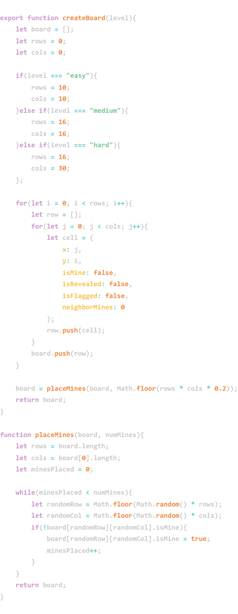

Buscaminas Moderno en React 💣
Un clon interactivo del clásico juego Buscaminas, desarrollado para demostrar habilidades de lógica algorítmica, manejo de estados complejos y diseño de interfaces con React y Tailwind CSS.

🚀 Descripción del proyecto
Este proyecto nace como un reto de programación enfocado en salir de la zona de confort de las aplicaciones tradicionales. El objetivo principal es la implementación de una lógica de juego robusta mediante el uso de matrices bidimensionales (arrays anidados) y algoritmos para la gestión de estados de celdas.

🛠️ Tecnologías utilizadas
React: Gestión del estado del juego y renderizado de componentes.

Tailwind CSS: Estilizado moderno, responsive y limpio.

JavaScript (ES6+): Implementación de la lógica matemática del juego.

Vite: Entorno de desarrollo rápido y eficiente.

🧩 Desafíos Técnicos Resueltos
Estructura de Datos: Implementación de una matriz bidimensional dinámica donde cada celda es un objeto con propiedades específicas (isMine, isRevealed, isFlagged, neighborMines).

Gestión de Estado: Control preciso del tablero utilizando estados de React, permitiendo interacciones fluidas entre la lógica matemática y la interfaz de usuario.

Lógica de Juego: Desarrollo de algoritmos para la generación aleatoria del tablero y la gestión de la lógica de "ganar/perder".

🚧 Estado del Proyecto
Actualmente, el proyecto se encuentra en fase de construcción. Estoy trabajando en la implementación del algoritmo de revelado en cascada y la lógica de detección de minas adyacentes.

Este proyecto es parte de mi portafolio para demostrar mis capacidades como desarrollador Frontend.

